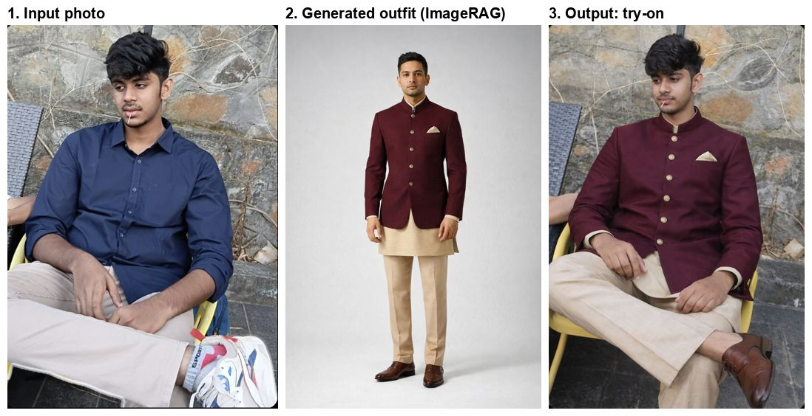

# Atelier — Celebrity-Matched Indo-Western Styling

**Upload a photo → find Indian celebrities with your body shape → get an indo-western
outfit designed from their wardrobes → see yourself wearing it.**



## Problem statement

People shopping for indo-western wear have no reliable way to know what will suit
*their* body. Celebrity looks are the usual reference, but a look only transfers if the
celebrity shares your proportions. This system:

1. **Reads the user's body geometry** from a single photo (shoulder, waist, hip ratios
   → body shape, build, height band).
2. **Matches celebrities by body shape, not ethnicity or fame** — an A-line anarkali
   flatters a pear frame for the same structural reasons an A-line dress does.
3. **Retrieves outfits those celebrities actually wore** from a labelled Indian
   celebrity wardrobe, and explains why each cut works for the user's frame.
4. **Designs a new indo-western outfit** that blends the matched celebrities' tastes
   (ImageRAG: generation conditioned on the retrieved outfits).
5. **Renders the user wearing it** — their own face, pose and background.

## Sample run

Input: a seated photo of a young man. Request: *"indo-western festive wear: a bandhgala
or nehru jacket over a kurta with tailored trousers"*.

| Stage | Result |
|---|---|
| Body analysis | rectangle frame, athletic build (confirmed by the user) |
| Celebrity match | 66 outfits from Indian menswear celebrities with a rectangle frame |
| Refine (ImageRAG) | found gaps *nehru jacket / bandhgala* and *tailored trousers*; filled both from the corpus |
| Generate | top 3 matched outfits used as references → maroon bandhgala over a beige kurta with trousers |
| Try-on | generated outfit placed on the user's own photo |

## How it works

```
photo ──► Analyze ──► Confirm shape ──► Retrieve ──► Refine ──► Generate ──► Try-on
          (VLM)       (user, 1 click)   (celebs w/   (ImageRAG  (ImageRAG    (user's
                                         same shape)  gap-fill)  w/ refs)     photo)
```

| Stage | What it does |
|---|---|
| **Analyze** | A vision model measures proportions; the shape is named by deterministic rules in `core/body.py`, not by the model. |
| **Confirm** | Single-photo inference is the weakest link (pose, angle, clothing), so low-confidence readings ask the user to confirm. |
| **Retrieve** | Hard filters on **body shape**, **wardrobe** (menswear/womenswear) and **region** (Indian); then hybrid search over two CLIP vectors, fused with Reciprocal Rank Fusion. |
| **Refine** | [ImageRAG](https://arxiv.org/abs/2502.09411): the VLM lists what the request asked for that results lack, writes a dense caption per gap, and retrieves on that caption. Unfillable gaps are reported, not hidden. |
| **Generate** | The matched celebrity outfits are the references for generation; the VLM checks the result and missing concepts trigger another retrieve-and-regenerate round. |
| **Try-on** | The generated outfit is placed on the user's photo, keeping face, pose and background. |

Every stage reports `done`, `skipped` or `failed` separately, so a missing backend
never looks like a crash.

## Celebrity wardrobe

| | |
|---|---|
| Roster | 1,897 celebrities from Wikidata (Indian, American, British), with Instagram handles and gender-derived wardrobe |
| Body profiles | 123 celebrities measured from full-body photos |
| Labelled outfits | 203 (garment, silhouette, neckline, culture, wardrobe, colours, caption) |
| Sources | Wikimedia Commons (licensed) and Instagram via a public mirror |

Each outfit carries `source` and `license`. A garment whose wardrobe contradicts its
account owner is dropped at ingest — an Instagram feed is not always of its owner.

## Architecture

Ports and adapters: every expensive or external capability sits behind a `Protocol` in
`src/fashion/ports/`, with a free fake for tests.

| Port | Used here | Test default |
|---|---|---|
| Vision | Claude via local proxy, or Gemini | fake VLM |
| Embeddings | OpenCLIP ViT-B-32 (CPU, disk-cached) | fake |
| Vector store | in-memory, or Qdrant | in-memory |
| Generation | Pollinations image edits (reference-guided); Colab SDXL + IP-Adapter | null |
| Try-on | Pollinations image edits; Colab worker | null |

```
src/fashion/
  core/       domain: body shapes, cross-cultural rules, ranking (no I/O)
  ports/      interfaces
  adapters/   vision, embeddings, stores, generation, try-on, image sources
  pipeline/   analyze → retrieve → refine (ImageRAG) → generate → try-on
  api/        FastAPI, async submit-and-poll jobs
  worker/     RQ worker
  ui/         Streamlit app
scripts/      roster, scraping, ingest, index, evaluation, Space deploy
colab/        free-T4 GPU worker notebook
```

## Quick start

```bash
uv sync --all-extras
uv run pytest                      # 242 tests, no keys or network needed
cp .env.example .env               # add keys to use real backends
uv run streamlit run src/fashion/ui/app.py
```

API: `uv run uvicorn fashion.api.app:app --port 8000` —
`POST /recommendations` returns a job id; `GET /recommendations/{id}` streams stage results.

Key settings in `.env`:

```
FASHION_VISION_PROVIDER=proxy        # or gemini
FASHION_EMBED_PROVIDER=openclip
FASHION_GENERATION_PROVIDER=pollinations
FASHION_TRYON_PROVIDER=pollinations
FASHION_POLLINATIONS_TOKEN=...
```

## Growing the wardrobe

```bash
uv run python scripts/fetch_roster.py --indian 1000
uv run python scripts/scrape_instagram.py --wardrobe menswear --limit-celebrities 20
uv run python scripts/build_index.py
```

## Deploy

Vercel cannot run this (long-lived Streamlit server, torch over the function size
limit, multi-minute generation). A free Hugging Face Docker Space can:

```bash
uv run hf auth login
uv run python scripts/deploy_space.py --space <user>/fashion-atelier
```

The script uploads the code with a compacted copy of the indexed images (539MB → 15MB).
Then set the Space secrets `FASHION_GEMINI_API_KEY` and `FASHION_POLLINATIONS_TOKEN`.

## Known limits

- Indo-western menswear is thin in the corpus (few fusion items), so recommendations
  lean ethnic or Western; generation compensates by blending them.
- Body shape from one photo is a prior, not a verdict — hence the confirm step.
- Hosted try-on sends the user's photo to the generation provider.
- Celebrity images carry their own licences; keep the repo private unless cleared.

Design decisions are recorded in [`docs/adr/`](docs/adr/).
